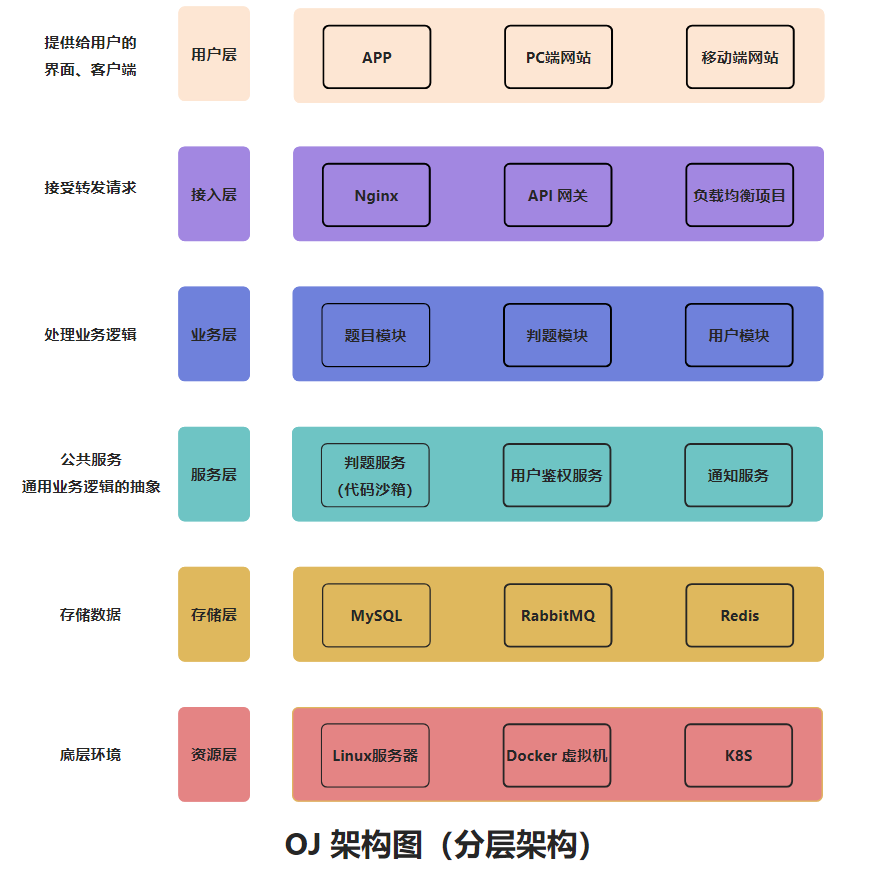

<p align="center">

</p>

# 智云判题系统

> 作者：[dy · 语雀](https://www.yuque.com/ding_yu)

## 项目介绍

本项目是基于 Spring Boot + Spring Cloud Alibaba 微服务 + Docker + RabbitMQ + Vue 3 的 **编程算法题目在线评测系统**
（简称OJ）。

在线访问：https://www.oj.dycoding.com

智云判题系统是一个在线算法评测系统，用户可以选择题目、编写代码并提交代码进行评测，而且是高效、稳定的 OJ
在线判题评测系统，它能够根据用户提交的代码、出题人预先设置的题目输入和输出用例，进行编译代码、运行代码、判断代码运行结果是否正确。

## 项目功能 🎊

### 题目模块

1. 创建题目（管理员）
2. 删除题目（管理员）
3. 修改题目（管理员）
4. 搜索题目（用户/管理员）
5. 题目管理（管理员）
6. 在线做题（用户/管理）
7. 提交题目代码（用户/管理）
8. 消息队列：防止判题服务执行时间过长，并使用死信队列处理判题失败的题目，避免消息积压。

### 用户模块

1. 注册
2. 登录，在微服务中使用JWT Token实现登录，在网关层面获取token登录消息，实现用户鉴权
3. 用户管理（管理员）
4. 用户上传头像功能，使用阿里云对象存储OSS存储图片
5. 用户限流。本项目使用到令牌桶限流算法，使用Redisson实现简单且高效分布式限流，限制用户每秒只能调用一次提交一次题目，防止用户恶意占用系统资源

### 判题模块

1. 提交判题：结果是否正确与错误
2. 错误处理：内存益出、安全性、超时
3. 代码沙箱：执行代码，返回执行信息
4. 开放接口：提供一个独立的新服务

### 代码沙箱
- 只负责接受代码和输入，运行代码，返回编译运行的结果，不用管用户提交的程序是否正确(不负责判题)

### OJ系统调研

1. https://github.com/HimitZH/HOJ (适合学习)
2. https://github.com/QingdaoU/OnlineJudge (python，不好学，很成熟)
3. https://github.com/hzxie/voj (在Github上的Start⭐⭐没那么多，没那么成熟，但相对好学)
4. https://github.com/fleaking/uoj (php实现的)
5. https://github.com/zhblue/hustoj (成熟，但是php实现)
6. https://github.com/hydro-dev/Hydro (功能强大，Node.js实现)

## 项目核心亮点 ⭐

1. 权限校验：用户权限校验
2. 代码沙箱（安全沙箱）
    - 用户代码藏毒：写个木马文件、修改系统权限
    - 沙箱：隔离的、安全的环境，用户的代码不会影响到沙箱之外的系统的运行
    - 资源分配：限制用户程序的占用资源
3. 判题规则
    - 题目用例的比对，结果的验证
4. 任务调度（消息队列执行判题）
    - 服务器资源有限，用户要排队，按照顺序去依次执行判题

## 快速启动 🏃‍♂️

1. 下载/拉取本项目到本地（shieroj-backend-single、shieroj-code-sandbox、shieroj-frontend）
2. 通过 IDEA 代码编辑器进行打开项目，等待依赖的下载
3. 修改配置文件 `application.yaml` 的信息，比如数据库、Redis、RabbitMQ等
4. 修改信息完成后，通过 `ShierApplication` 程序进行运行项目

## 项目结构图 🌟




## 项目核心业务流程 🔥

判题服务：获取题目信息、预计的输入输出结果，返回给主业务后端：用户的答案是否正确
代码沙箱：只负责运行代码，给出程序运行的结果，不用管用户提交的程序是否正确。 因此 判题服务 和 代码沙箱 实现了解耦


核心流程时序图


## 微服务项目

### 服务模块划分

1. shieroj-backend-common：系统通用模块，比如用户角色权限校验，异常处理，统一返回值，常量，工具类等
2. shieroj-backend-file-service：系统文件模块，比如用户头像上传等
3. shieroj-backend-gateway：系统网关模块：实现了给前端返回统一接口路由，聚合文档（Knife4j），全局跨域配置，权限校验（JWT Token）等
4. shieroj-backend-judge-service：系统判题模块：调用远程代码沙箱接口，实现工厂模式、策略模式、代理模式，验证代码沙箱执行结果是否正确与错误，使用消息队列实现异步处理消息
5. shieroj-backend-model：系统实体模块，比如用户实体类、题目实体类，VO、枚举等
6. shieroj-backend-question-service：系统题目模块：题目的增删改查、题目提交限流、使用消息队列异步处理消息
7. shieroj-backend-service-client：系统内部调用模块，给内部系统提供调用接口
8. shieroj-backend-user-service：系统用户模块，管理员对用户的增删改查，用户自己信息查询，修改，头像上传。

## 项目技术栈和特点 ❤️‍🔥

### 后端

1. Spring Boot：简化Spring开发框架
2. Spring MVC：
3. Spring Boot 调试工具和项目处理器
4. Spring AOP 切面编程
5. Spring 事务注解
6. Spring Cloud Alibaba
7. Spring Gateway
8. MyBatis + MyBatis Plus 数据访问（开启分页）
9. MyBatis-Plus 数据库访问结构
10. Redis：分布式存储用户信息
11. Redisson：限流控制
12. JWT Token：用户鉴权
13. RabbitMQ：消息队列
14. Docker 代码沙箱，实现隔离环境运行Java程序
15. Java安全管理器：保护 JVM、Java 安全的机制，实现对资源的操作限制
16. Nacos：服务注册管理中心
17. OpenFeign：微服务模块之间调用

### 前端

1. Vue 3
2. Vue Router: 路由管理
3. Vue-Cli 脚手架
4. Axios: HTTP客户端
5. Bytemd: Markdown 编辑器
6. Monaco Editor: 代码编辑器
7. highlight.js: 语法高亮
8. Moment.js: 日期处理库
9. Arco Design Vue: UI组件库
10. TypeScript: 静态类型系统

### 数据存储

- MySQL 数据库
- 阿里云 OSS 对象存储

### 通用特性

- Spring Session Redis 分布式登录
- 全局请求响应拦截器（记录日志）
- 全局异常处理器
- 自定义错误码
- 封装通用响应类
- Swagger + Knife4j 接口文档
- 自定义权限注解 + 全局校验
- 全局跨域处理
- 长整数丢失精度解决
- 多环境配置
- IDEA插件 MyBatisX ： 根据数据库表自动生成
- Hutool工具库 、Apache Common Utils、Gson 解析库、Lombok 注解

### 单元测试

- JUnit5 单元测试、业务功能单元测试

### 设计模式

- 静态工厂模式
- 代理模式
- 策略模式

### 远程开发

- VMware Workstation虚拟机
- Ubuntu Linux 18
- Docker环境
- 使用JetBrains Client连接

### 单体项目目录结构

```
├─.idea
│  ├─dataSources
│  │  ├─960cd114-d89f-4d77-8df6-3629b7afd20b
│  │  │  └─storage_v2
│  │  │      └─_src_
│  │  │          └─schema
│  │  └─c50de2a1-d23c-401f-bb0b-544d6b54f96d
│  │      └─storage_v2
│  │          └─_src_
│  │              └─schema
│  ├─httpRequests
│  └─inspectionProfiles
├─assets
├─dyoj-backend-common
│  ├─src
│  │  ├─main
│  │  │  ├─java
│  │  │  │  └─com
│  │  │  │      └─dy
│  │  │  │          ├─annotation
│  │  │  │          ├─common
│  │  │  │          ├─config
│  │  │  │          ├─constant
│  │  │  │          ├─exception
│  │  │  │          └─utils
│  │  │  └─resources
│  │  │      └─META-INF
│  │  └─test
│  │      └─java
│  │          └─com
│  │              └─dy
│  └─target
│      ├─classes
│      │  ├─com
│      │  │  └─dy
│      │  │      ├─annotation
│      │  │      ├─common
│      │  │      ├─config
│      │  │      ├─constant
│      │  │      ├─exception
│      │  │      └─utils
│      │  └─META-INF
│      ├─generated-sources
│      │  └─annotations
│      ├─generated-test-sources
│      │  └─test-annotations
│      ├─maven-archiver
│      ├─maven-status
│      │  └─maven-compiler-plugin
│      │      ├─compile
│      │      │  └─default-compile
│      │      └─testCompile
│      │          └─default-testCompile
│      └─test-classes
│          └─com
│              └─dy
├─dyoj-backend-file-service
│  ├─src
│  │  ├─main
│  │  │  ├─java
│  │  │  │  └─com
│  │  │  │      └─dy
│  │  │  │          ├─controller
│  │  │  │          ├─service
│  │  │  │          │  └─impl
│  │  │  │          └─utils
│  │  │  └─resources
│  │  └─test
│  │      └─java
│  │          └─com
│  │              └─dy
│  └─target
│      ├─classes
│      │  └─com
│      │      └─dy
│      │          ├─controller
│      │          ├─service
│      │          │  └─impl
│      │          └─utils
│      ├─generated-sources
│      │  └─annotations
│      ├─generated-test-sources
│      │  └─test-annotations
│      ├─maven-archiver
│      ├─maven-status
│      │  └─maven-compiler-plugin
│      │      ├─compile
│      │      │  └─default-compile
│      │      └─testCompile
│      │          └─default-testCompile
│      └─test-classes
│          └─com
│              └─dy
├─dyoj-backend-gateway
│  ├─src
│  │  ├─main
│  │  │  ├─java
│  │  │  │  └─com
│  │  │  │      └─dy
│  │  │  │          ├─config
│  │  │  │          ├─controller
│  │  │  │          └─filter
│  │  │  └─resources
│  │  └─test
│  │      └─java
│  │          └─com
│  │              └─dy
│  │                  └─controller
│  └─target
│      ├─classes
│      │  └─com
│      │      └─dy
│      │          ├─config
│      │          ├─controller
│      │          └─filter
│      ├─generated-sources
│      │  └─annotations
│      ├─generated-test-sources
│      │  └─test-annotations
│      ├─maven-archiver
│      ├─maven-status
│      │  └─maven-compiler-plugin
│      │      ├─compile
│      │      │  └─default-compile
│      │      └─testCompile
│      │          └─default-testCompile
│      └─test-classes
│          └─com
│              └─dy
│                  └─controller
├─dyoj-backend-judge-service
│  ├─src
│  │  ├─main
│  │  │  ├─java
│  │  │  │  └─com
│  │  │  │      └─dy
│  │  │  │          └─judge
│  │  │  │              ├─codesanbox
│  │  │  │              │  ├─impl
│  │  │  │              │  └─proxy
│  │  │  │              ├─config
│  │  │  │              ├─controller
│  │  │  │              ├─listener
│  │  │  │              ├─service
│  │  │  │              └─strategy
│  │  │  └─resources
│  │  └─test
│  │      └─java
│  │          └─com
│  │              └─dy
│  └─target
│      ├─classes
│      │  └─com
│      │      └─dy
│      │          └─judge
│      │              ├─codesanbox
│      │              │  ├─impl
│      │              │  └─proxy
│      │              ├─config
│      │              ├─controller
│      │              ├─listener
│      │              ├─service
│      │              └─strategy
│      ├─generated-sources
│      │  └─annotations
│      ├─generated-test-sources
│      │  └─test-annotations
│      ├─maven-archiver
│      ├─maven-status
│      │  └─maven-compiler-plugin
│      │      ├─compile
│      │      │  └─default-compile
│      │      └─testCompile
│      │          └─default-testCompile
│      └─test-classes
│          └─com
│              └─dy
├─dyoj-backend-model
│  ├─src
│  │  ├─main
│  │  │  └─java
│  │  │      └─com
│  │  │          └─dy
│  │  │              ├─codesanbox
│  │  │              ├─dto
│  │  │              │  ├─file
│  │  │              │  ├─question
│  │  │              │  ├─questionsubmit
│  │  │              │  └─user
│  │  │              ├─entity
│  │  │              ├─enums
│  │  │              └─vo
│  │  └─test
│  │      └─java
│  │          └─com
│  │              └─dy
│  └─target
│      ├─classes
│      │  └─com
│      │      └─dy
│      │          ├─codesanbox
│      │          ├─dto
│      │          │  ├─file
│      │          │  ├─question
│      │          │  ├─questionsubmit
│      │          │  └─user
│      │          ├─entity
│      │          ├─enums
│      │          └─vo
│      ├─generated-sources
│      │  └─annotations
│      ├─generated-test-sources
│      │  └─test-annotations
│      ├─maven-archiver
│      ├─maven-status
│      │  └─maven-compiler-plugin
│      │      ├─compile
│      │      │  └─default-compile
│      │      └─testCompile
│      │          └─default-testCompile
│      └─test-classes
│          └─com
│              └─dy
├─dyoj-backend-question-service
│  ├─src
│  │  ├─main
│  │  │  ├─java
│  │  │  │  └─com
│  │  │  │      └─dy
│  │  │  │          ├─config
│  │  │  │          ├─controller
│  │  │  │          │  └─inner
│  │  │  │          ├─manager
│  │  │  │          ├─mapper
│  │  │  │          └─service
│  │  │  │              └─impl
│  │  │  └─resources
│  │  └─test
│  │      └─java
│  │          └─com
│  │              └─dy
│  └─target
│      ├─classes
│      │  └─com
│      │      └─dy
│      │          ├─config
│      │          ├─controller
│      │          │  └─inner
│      │          ├─manager
│      │          ├─mapper
│      │          └─service
│      │              └─impl
│      ├─generated-sources
│      │  └─annotations
│      ├─generated-test-sources
│      │  └─test-annotations
│      ├─maven-archiver
│      ├─maven-status
│      │  └─maven-compiler-plugin
│      │      ├─compile
│      │      │  └─default-compile
│      │      └─testCompile
│      │          └─default-testCompile
│      └─test-classes
│          └─com
│              └─dy
├─dyoj-backend-service-client
│  ├─src
│  │  ├─main
│  │  │  ├─java
│  │  │  │  └─com
│  │  │  │      └─dy
│  │  │  │          └─client
│  │  │  │              ├─config
│  │  │  │              └─service
│  │  │  └─resources
│  │  └─test
│  │      └─java
│  │          └─com
│  │              └─dy
│  │                  └─dyojbackendserviceclient
│  └─target
│      ├─classes
│      │  └─com
│      │      └─dy
│      │          └─client
│      │              ├─config
│      │              └─service
│      ├─generated-sources
│      │  └─annotations
│      ├─generated-test-sources
│      │  └─test-annotations
│      ├─maven-archiver
│      ├─maven-status
│      │  └─maven-compiler-plugin
│      │      ├─compile
│      │      │  └─default-compile
│      │      └─testCompile
│      │          └─default-testCompile
│      └─test-classes
│          └─com
│              └─dy
│                  └─dyojbackendserviceclient
├─dyoj-backend-user-service
│  ├─src
│  │  ├─main
│  │  │  ├─java
│  │  │  │  └─com
│  │  │  │      └─dy
│  │  │  │          ├─aop
│  │  │  │          ├─controller
│  │  │  │          │  └─inner
│  │  │  │          ├─mapper
│  │  │  │          └─service
│  │  │  │              └─impl
│  │  │  └─resources
│  │  └─test
│      │          ├─controller
│      │          │  └─inner
│      │          ├─mapper
│      │          └─service
│      │              └─impl
│      ├─generated-sources
│      │  └─annotations
│      ├─generated-test-sources
│      │  └─test-annotations
│      ├─maven-archiver
│      ├─maven-status
│      │  └─maven-compiler-plugin
│      │      ├─compile
│      │      │  └─default-compile
│      │      └─testCompile
│      │          └─default-testCompile
│      └─test-classes
│          └─com
│              └─dy
└─sql
```


## 后续项目扩展

- 多语言代码沙箱

> 项目图片来源  [猫十二懿佬](https://github.com/ShierOJSystem)


